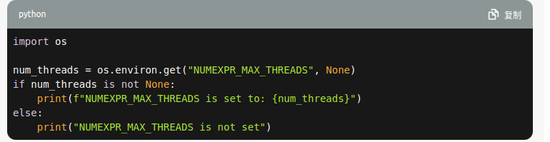
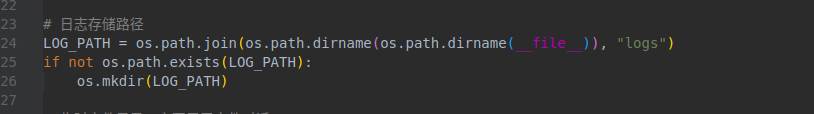

# Langchain-chatchat 代码record

### 1 对于环境变量的创建
```
try:
    import numexpr

    n_cores = numexpr.utils.detect_number_of_cores()
    os.environ["NUMEXPR_MAX_THREADS"] = str(n_cores)
except:
    pass

```


### 2 对于环境变量的使用

```
import os

num_threads = os.environ.get("NUMEXPR_MAX_THREADS", None)
if num_threads is not None:
    print(f"NUMEXPR_MAX_THREADS is set to: {num_threads}")
else:
    print("NUMEXPR_MAX_THREADS is not set")

```


### 3 对于路径添加到系统变量

```
sys.path.append(os.path.dirname(__file__))         
sys.path

```
### 4 日志 占位符

```
定义:

LOG_FORMAT = "%(asctime)s - %(filename)s[line:%(lineno)d] - %(levelname)s: %(message)s"
# 2023-05-29 16:20:30 - my_script.py[line:42] - INFO: This is an informational message.
logger = logging.getLogger()
logger.setLevel(logging.INFO)
logging.basicConfig(format=LOG_FORMAT)


```

### 5 路径创建
```
aim_path = os.path.join(os.path.dirname(__file__),"aim_folder")
if not aim_path:
    os.mkidr(aim_path)

```



## English 
1

"verbose" 是一个形容词,它描述了某种事物或行为的性质。在计算机编程和技术领域,它通常用来表示以下含义:

冗长的、详细的、多话的:

一个冗长啰嗦的程序输出被称为"verbose output"。

一个详细记录了许多信息的日志文件也可以被称为"verbose log"。

提供了大量信息或细节:

一个冗长、详细的文档或说明被称为"verbose documentation"。

一个提供了大量调试信息的程序被称为"running in verbose mode"。

过多地使用文字:

一个过于啰嗦冗长的程序员被称为"ve rbose programmer"。


一个人说话过于唠叨也可以被形容为"verbose"。

2

"Pending"的中文意思是"待定"。它用来表示某事物或情况还没有最终确定或决定，仍然在等待进一步的处理或决策。在待定状态下，事情可能还没有被处理、决定或完成，需要更多时间或信息来做出最终的决策。

3 

ret = []  ret 这个词通常是 return 这个词的缩写形式，它是一个常见的命名习惯，用来表示一个变量用于存储函数的返回值。


